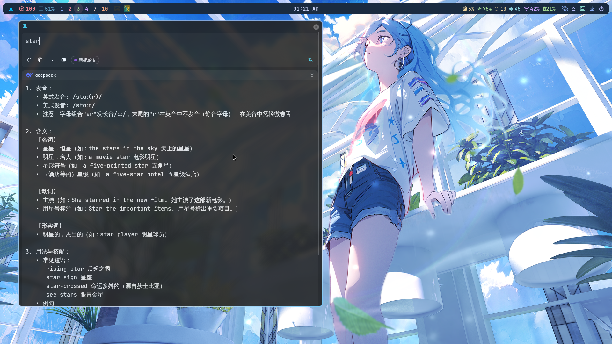
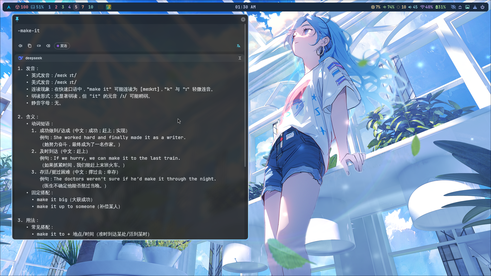
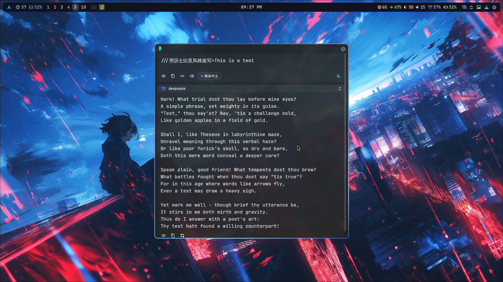

# 🔍Pot DeepSeek翻译插件 - 英语学习者的智能助手

## ✨ 核心功能亮点✨
- **📖 单词详解**  
  ✅ 发音指导：美式/英式发音、音标、连读弱读标记、不发音字母提示  
  ✅ 多维度释义：词性分类、多种词义解释、实用例句  
  ✅ 用法解析：常见搭配、短语、句式示例  
  ✅ 自动优化显示格式  

- **🔤 短语解析**  
  ✅ 动词短语/固定搭配详解  
  ✅ 上下文用法示例  
  ✅ 支持连字符模式识别 [具体介绍](#短语识别模式使用说明)  
  ✅ 自动优化显示格式  

- **🌍 句子翻译**  
  ✅ 专业流畅的翻译结果

- **🎛️ 高级自定义**  
  ✅ 自定义指令模式（///指令>内容） [使用方法](#自定义指令模式使用说明) 
  ✅ 精细控制生成参数（随机性/多样性等）  
  ✅ 支持多种AI任务（翻译/改写/解释等）  
  ✅ 参数实时调节即时生效  

## 🎯 适用场景 & 人群👥
- **最适合**：英语初学者/中级学习者  
- **最佳用途**：单词深度学习、短语用法掌握  
- **特色优势**：比牛津词典更易懂的发音指导，更实用的用法解析  

- **随时随地可用的AI助手**：
  ✅ 快速翻译/改写/解释文本
  ✅ 一键获取专业级分析
  ✅ 无需切换应用，随用随走
  ✅ 支持自定义工作流

## ⚡ 快速开始🚀
1. 📥 安装pot-app ([下载地址](https://github.com/pot-app/pot-app))
2. 🔑 获取DeepSeek API密钥 ([申请地址](https://platform.deepseek.com/usage))
3. 📦 选择本插件的发布包(potext文件)进行安装([点击下载](https://github.com/Erenind/pot-app-translate-plugin-deepseek/releases/download/v2.0.0/plugin.Erenind.deepseek.potext))
4. ⚙️ 安装本插件并配置API密钥([配置选项说明](#配置选项说明))
5. 🎉 开始享受专业英语学习体验！

## 🖼️ 效果预览📸
| 功能 | 示例 |
|------|------|
| 单词详解 |  |
| 单词基本 |  |
| 短语解析 |  | 
| 短语简略 |  |
| 句子翻译 |  |
| 自定义模式|  |

### ⚙️ 配置选项说明
| 配置项 | 选项 | 默认值 | 说明 |
|--------|------|--------|------|
| 模型选择 | deepseek-chat deepseek-reasoner | deepseek-chat | DeepSeek提供的翻译模型 |
| API密钥 | 文本输入 | 无 | 从DeepSeek平台获取的API密钥 |
| 单词/短语信息 | 不显示  基本用法  完整信息(发音/释义/用法) | 完整信息(发音/释义/用法) | 控制单词/短语解释详细程度 |
| 连字符短语模式 | 禁用  启用(-标识/连接短语) | 启用(-标识/连接短语) | 启用后可使用-make-it格式输入短语 |
| 短语解释模式 | 仅翻译  基本用法  详细解释 | 详细解释 | 控制短语解释详细程度 |
| 自定义指令模式 | 启用(可使用///指令>内容格式) 禁用 | 启用 | 启用后可使用自定义指令格式 |
| 输出随机性(temperature) | 0.1 - 精准模式(最稳定) 0.5 - 平衡模式 0.8 - 创意模式 1.2 - 高随机性 1.5 - 实验性输出 | 0.1 | 控制输出的随机性 |
| 输出多样性(top_p) | 0.9 - 精准筛选 0.95 - 适度多样 0.99 - 广泛采样 1.0 - 完全开放 | 0.99 | 控制输出的多样性 |
| 重复控制(frequency_penalty) | -1.0 - 允许更多重复 0 - 默认平衡 0.5 - 减少重复 1.0 - 严格去重 | 0 | 控制内容的重复程度 |
| 内容新颖度(presence_penalty) | -1.0 - 偏好常见内容 0 - 平衡模式 0.5 - 鼓励新内容 1.0 - 强创新性 | 0 | 控制内容的新颖程度 |
| 响应长度(max_tokens) | 500 - 简短响应 1000 - 中等长度 2000 - 详细解释 4000 - 最大长度 | 2000 | 控制生成内容的长度 |

### 🔤 短语识别模式使用说明
1. **格式**：`-短语单词1-短语单词2`  
2. **示例**：  
   - `-make-up` → 解析为"make up"  
   - `-look-forward-to` → 解析为"look forward to"  
3. **特点**：  
   - 自动识别连字符短语  
   - 提供详细用法解析  
   - 支持三种详细程度设置

### ✍️ 自定义指令模式使用说明
1. **格式**：`///指令>要处理的内容`或者`///>问题`(无系统提示)
2. **示例**：
   - `///翻译成法语>Hello world`
   - `///用莎士比亚风格改写>This is a test`
   - `///>What is the meaning of life?`
3. **特点**：
   - 完全自定义系统提示词
   - 保留原有翻译功能
   - 可通过配置开关启用/禁用

### 🎚️ 高级参数说明
1. **temperature**：值越高输出越随机有创意，值越低输出越稳定精准
2. **top_p**：控制输出多样性，值越小结果越保守
3. **frequency_penalty**：正值减少重复内容，负值增加重复
4. **presence_penalty**：正值鼓励新内容，负值偏好常见内容
5. **max_tokens**：控制生成内容的长度限制

## ⚠️ 注意事项❗📢
- 翻译需要3-30秒等待时间（深度学习需要时间）
- 建议同时使用其他翻译服务作为备用
- 请妥善保管你的API密钥

## 🛠️ 插件技术细节🔧

### ⚙️ 核心功能实现💡
- **单词/短语识别**：
  - 自动检测输入内容类型（单词/短语/句子）
  - 支持连字符模式识别短语（如-make-it → make it）

- **多级解释系统**：
  - 单词解释模式（基础/详细）
  - 短语解释模式（仅翻译/基本解释/详细分析）
  - 句子翻译模式

- **内容格式化**：
  - 自动去除Markdown格式（#标题、\*\*粗体\*\*等）
  - 优化无序列表显示（将-替换为•）
  - 保留必要的内容结构
  - 完整文本处理流程：
    1. 删除Markdown标题（#、##等）
    2. 删除粗体标记（\*\*粗体\*\*）
    3. 除斜体标记（\*斜体\*）
    4. 删除分割线（\---）
    5. 替换无序列表符号（- → •）
    6. 保留专业术语中的特殊符号（如C#）
    7. 保留URL链接
    8. 保留表格结构

### 📝 开发说明👨‍💻
- 开源协议：MIT License
